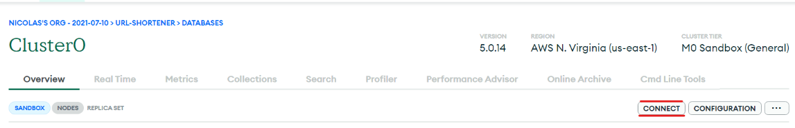
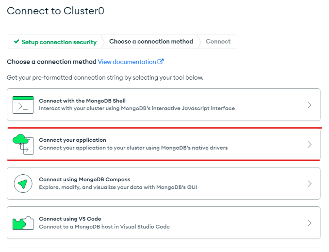
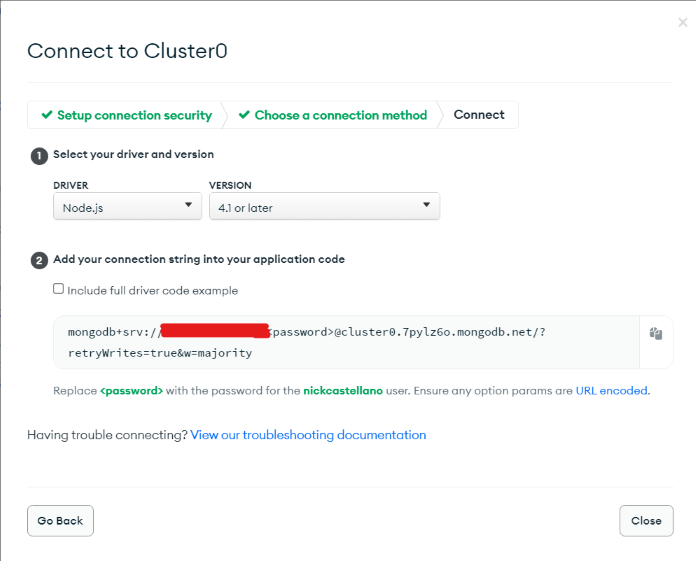

# Todo App with Express Mongo JWT

<br>
<br>

A server for my todo app using node.js, express and mongo.

<br>
<br>

## About the environment

<br>

- This project was made on node.js 18
- You need a Mongo Atlas account and have a cluster set up
- You need to set up environment variables on the server. In case you are deploying your service to the cloud, please refer to your cloud provider's guides for instructions on environment variables.

<br>
<br>

## How to install locally
<br>
<br>

### Set up the mongodb

<br>

Create a mongodb Atlas database, for it you will need to have an account on their site (https://www.mongodb.com/atlas/database) and set up a cluster.

Go to your cluster page, it should look like this.




Click on Connect on the top right side of the page, there you will find the instructions for connecting your application to the remote database.



Copy the connection string to your clipboard



<br>
<br>

### Create a .env file

<br>

Create a file name .env with the following content. Remember that you should have the connection string copied to your clipboard. Paste it in the first field.
```env:
MONGO_URL = {your_mongo_atlas_connection_string}
JWT_PASSWORD = {Your_jwt_private_token_password}
```

<br>
<br>

### Install dependencies

<br>

On the project directory, install the dependencies using the following command.

```bash:
npm i
# or npm install
```
<br>
<br>

### Start the application

<br>

Use the following command

```bash:
npm run dev
# or npm run start
```

<br>
<br>